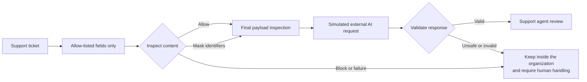

# SecureLaunch AI

**AI security case study · Python control gateway · Amazon Bedrock Guardrails**


SecureLaunch AI is a hands-on security case study showing how an organization can reduce sensitive-data exposure **before** a support ticket is sent to an external AI provider. I translated security policy into a working Python gateway, tested it with 43 automated checks, and independently configured Amazon Bedrock Guardrails to validate the same boundary on a real cloud security service.

**This is an AI security project—not a project about building an AI model.** It focuses on the controls, risk decisions, evidence, and human accountability that should surround AI adoption.

## The project in 60 seconds

LindenArc is a fictional B2B financial-operations software company. It wants to introduce Signal, an AI-assisted feature that summarizes support tickets and suggests approved troubleshooting steps. The proposed feature would send selected ticket content to an external AI provider.

That creates a security question: **How can the company gain value from AI without unnecessarily exposing personal information, payment data, credentials, proprietary identifiers, or malicious instructions?**

I approached the problem as a security analyst:

1. Defined the business purpose, data boundary, prohibited actions, and realistic threat scenarios.
2. Traced data through its lifecycle and connected risks to security controls and evidence.
3. Built a Python gateway that minimizes fields, detects sensitive content, masks or blocks it, inspects the final payload, validates the response, and fails safely.
4. Tested the gateway against fixed synthetic scenarios and failure conditions.
5. Independently configured and tested Amazon Bedrock Guardrails with managed PII detection, prompt-attack protection, and a custom organization-specific rule.
6. Recorded what the evidence proves, what it does not prove, and which risks still require other controls.

## Evidence at a glance

| Evidence | Result |
|---|---:|
| Automated Python security checks | **43 passed** |
| Fixed local gateway scenarios | **15** |
| Selected AWS Guardrail scenarios | **9 of 9 matched expectations** |
| Configured AWS PII detectors | **12** |
| Organization-specific AWS regex controls | **1** |
| Immutable Guardrail version | **Version 1 smoke-tested and reproduced through the API** |
| Foundation-model calls during AWS validation | **0** |
| Real customer records used | **0** |

The two validation environments are intentionally separate. The Streamlit demonstration runs the Python gateway locally against a simulated external service; it does not call AWS. The AWS lab independently demonstrates managed guardrail behavior using real Amazon Bedrock Guardrails and synthetic data.

## How the security boundary works



The local gateway makes three security decisions:

| Decision | Meaning | Example |
|---|---|---|
| **Allow** | Continue when the approved content contains no configured risk indicator | Clean receipt-upload problem |
| **Mask** | Remove an unnecessary identifier while preserving useful support context | Email address or LindenArc account reference |
| **Block** | Create no external-provider API request; keep the ticket in the organization for manual handling | SSN, payment-card data, cloud credentials, or prompt manipulation |

The gateway also tests timeouts, provider errors, malformed responses, unknown issue categories, a security kill switch, and reinspection of the exact serialized payload. These cases matter because a control should fail safely, not disappear when a dependency behaves unexpectedly.

## Independent AWS validation

I configured the Amazon Bedrock Guardrail `lindenarc-signal-boundary-v1` in `us-east-1` and tested a risk-based set of allow, mask, block, false-positive, and output-inspection cases. After all nine scenarios matched their expected outcomes, I froze the tested configuration as Version 1, performed a smoke test, and reproduced a result through the `ApplyGuardrail` API.

The custom pattern `ACCT-(SYNTH-)?[0-9]{4,12}` represents a LindenArc account reference:

- `ACCT-` requires the organization-specific prefix.
- `(SYNTH-)?` permits the optional synthetic-data marker used in the lab.
- `[0-9]{4,12}` requires a 4-to-12-digit identifier.

This complements AWS managed detectors because a cloud service cannot automatically know every identifier format unique to an organization.

Read the complete [Amazon Bedrock Guardrail validation report](evidence/aws/AWS_GUARDRAIL_VALIDATION_REPORT.md), including the configuration, expected-versus-observed results, screenshots, Version 1 evidence, API reproduction, and test limitations.

## Explore the project

### Interactive reviewer experience

The Streamlit interface presents the business context, working gateway, AWS evidence, risk decisions, framework relevance, and my reasoning in a guided format. To run it locally:

```powershell
python -m venv .venv
.venv\Scripts\Activate.ps1
python -m pip install -r requirements.txt
streamlit run app.py
```

On macOS or Linux, activate the environment with `source .venv/bin/activate` before installing the requirements.

### Verify the code

```powershell
python -m pytest -q
```

The GitHub Actions workflow runs the same test suite and performs a headless interface-load check on every push and pull request.

### Reviewer-ready reports

These five concise Word reports are also downloadable from the application:

1. [Project scope, architecture, and security boundary](outputs/reviewer_documents/01-project-scope-and-security-boundary.docx)
2. [Data lifecycle and risk analysis](outputs/reviewer_documents/02-data-lifecycle-and-risk-analysis.docx)
3. [Python security gateway technical report](outputs/reviewer_documents/03-python-security-gateway-technical-report.docx)
4. [Validation evidence report](outputs/reviewer_documents/04-validation-evidence-report.docx)
5. [Risk treatment and project lessons](outputs/reviewer_documents/05-risk-treatment-and-project-lessons.docx)

## Repository guide

| Location | What it contains |
|---|---|
| `app.py` | Official Streamlit entry point for the approved reviewer experience |
| `src/securelaunch/` | Python gateway, inspection, provider-boundary, response-validation, configuration, and evidence logic |
| `config/` | Versioned security policy and approved support playbooks |
| `data/` | Fifteen synthetic scenarios with expected outcomes |
| `tests/` | Automated tests for the security decisions and failure paths |
| `presentation/` | Interface content, evidence helpers, and visual theme |
| `evidence/aws/` | AWS report, sanitized API result, and console screenshots |
| `outputs/reviewer_documents/` | Five polished reviewer-ready Word reports |
| `work/` | Detailed architecture, data, PASTA, risk, and decision records |

## Risk and governance perspective

The project connects technical controls to business risk. It uses selected concepts from the NIST Cybersecurity Framework 2.0 and NIST AI Risk Management Framework and discusses the relevance of GDPR data-protection principles and the FTC Safeguards Rule where applicable.

These are transparent relevance mappings—not claims of certification, legal compliance, or a complete organizational security program. The prototype does not prove tenant isolation, provider retention practices, production access controls, universal detection accuracy, or factual accuracy of AI-generated content. Those limitations are documented because knowing what evidence cannot establish is part of responsible security analysis.

## Why I built it

As organizations move quickly to adopt AI, I want to understand the new exposure that adoption creates—not only how to use the technology. I built this project to apply cybersecurity coursework and cloud-security knowledge to a realistic business problem: protecting sensitive information, designing enforceable boundaries, testing whether those boundaries work, and communicating the results to both technical and business audiences.

The project demonstrates security analysis, Python control engineering, threat modeling, cloud-security validation, test design, risk communication, and the ability to connect technical evidence to business decisions.

## Project ownership and AI-assisted presentation

I developed the Python security gateway and automated tests, completed the risk analysis, and independently configured and tested the Amazon Bedrock Guardrail. The security decisions, evidence, and conclusions in this repository reflect that work.

I used AI-assisted development for the visual implementation of the reviewer-facing Streamlit interface. I defined the content, visual direction, and acceptance criteria so the interface would communicate my technical work clearly.

I created LindenArc as a realistic fictional business scenario so I could apply security analysis and control design without using a real organization's information. The support tickets are realistic synthetic records that I created to test the Python gateway and AWS Guardrail configuration. The Python demonstration uses a simulated external AI service; the Amazon Bedrock Guardrail configuration and the recorded AWS results are real.

## Scope statement

SecureLaunch AI is a bounded portfolio case study. It is not a production deployment, penetration test, audit, certification, legal opinion, or claim of compliance. It uses no real customer, personal, financial, confidential, or credential data.

---

**Eniola Durojaiye** · Cybersecurity and Information Assurance · Security analysis, risk, Python, and cloud validation
