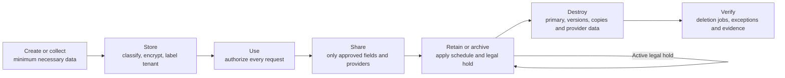

# LindenArc Data Inventory and Lifecycle

**Status:** Phase 3 complete; audited on September 5 and reconciled to the evidence-backed portfolio scope on September 7, 2026  
**Purpose:** Identify the important data in scope, who is accountable for it, where it travels, how it is protected, how long it is kept, and how deletion actually works  
**Scope:** Simulated SecureLaunch AI readiness review; these are proposed policies, not proof of implementation or legal advice

## 1. Why this artifact exists

An architecture diagram shows systems and connections. A data inventory asks a different question: **what information is inside those systems, and what must happen to it throughout its life?**

This inventory gives each important data family a stable `DATA-##` identifier. Later analysis can connect a data family to a flow, threat, risk, safeguard, evidence item, and release gate.

## 2. Classification scheme

| Classification | Plain-language meaning | LindenArc examples |
|---|---|---|
| Public | Approved for anyone to see | Published website files and approved public documentation |
| Internal | Intended for LindenArc personnel but unlikely to cause serious harm by itself | Approved troubleshooting playbooks and nonsensitive operating procedures |
| Confidential | Customer or business information that requires controlled access | Invoices, expenses, receipts, ordinary support tickets, AI summaries, and operational logs |
| Restricted | Highest-impact information requiring the narrowest access and strongest handling | Authentication secrets, payment-provider references, banking details held by the provider, and ticket text containing credentials or highly sensitive personal information |

Classification follows the content, not merely the storage location. For example, ticket text is Confidential by default but becomes Restricted when a customer places a password, Social Security number, banking information, or similar high-risk content inside it.

## 3. Accountability model

- The **customer organization** remains the business owner of its submitted financial records, documents, and ticket content.
- The relevant **LindenArc service owner** is accountable for defining and enforcing the platform's handling rules.
- LindenArc engineering and operations act as **custodians** that operate the technical safeguards.
- AWS, the AI provider, and the payment provider perform limited processing under defined service and contract responsibilities.
- Exact privacy-law roles such as controller and processor depend on the contract, purpose, and jurisdiction. This case study does not make a universal legal determination.

## 4. Retention schedule proposals

These periods are LindenArc **project decisions to validate** with legal counsel, privacy personnel, customer contracts, and applicable jurisdictions before a real launch. They are not presented as universal legal requirements.

| Schedule | Proposed period | Reason and final disposition |
|---|---|---|
| RS-01 — Identity and tenancy | Active relationship plus 90 days | Supports account closure and recovery; then remove the primary account and membership data, subject to holds and necessary audit evidence |
| RS-02 — Financial business record | Seven years after the applicable financial period closes | Proposed business default for financial-workflow continuity; delete primary records and related objects after validation that no contract, dispute, or hold requires preservation |
| RS-03 — Support case | Ordinary case record: two years after closure. When prohibited or high-risk content is detected: restrict ordinary viewing immediately, revoke exposed credentials immediately, and target redaction or removal within five business days after required security/legal handling; any delay beyond 30 days requires a documented exception | Preserves useful service history without retaining unnecessary high-risk content. Keep a redacted case when possible; allow affected recovery copies to expire under RS-07 and verify the result |
| RS-04 — Logs and evidence | CloudWatch operational logs: 90 days; selected centralized security records: one year readily available and no more than three years total unless a documented contract, investigation, or legal hold requires longer | Limits routine exposure while preserving useful investigation history. Financial approval and transaction history follows RS-02 instead of being hidden inside a broad security-log schedule |
| RS-05 — Background work | Successful SQS message: delete immediately; primary queue: no more than four days; dead-letter queue: 14 days; completed outbox row: 30 days | Keeps only the identifiers needed to complete or investigate work; no raw ticket or banking content belongs in queues |
| RS-06 — External AI processing | No model training and no durable provider storage after processing; any unavoidable provider security retention must be explicitly approved and contractually bounded, with 30 days as the proposed ceiling | Minimizes the copy outside AWS; failure to meet the approved terms blocks release |
| RS-07 — Recovery copies | Continuous or daily recovery points: 35 days; no year-long full-system monthly copy in the initial design | Provides ransomware and operational recovery while preventing support tickets and other mixed production data from surviving for an extra year merely because they share a backup with financial records; legal holds are handled separately |
| RS-08 — Playbooks and categories | Current version while approved; superseded versions for two years | Preserves which human-authored guidance was shown with support cases during the support-record period |
| RS-09 — Secrets and trust material | Keep only while required; rotate based on risk and provider support; revoke old material when replacement succeeds | Schedule controlled deletion after dependency checks and the AWS recovery waiting period; never delete a shared encryption key merely to erase one tenant's record |
| RS-10 — Reusable support knowledge | Review at least annually; delete three years after the last documented validation unless an owner renews it | Retain only an approved, de-identified resolution article—not the original case. Retire immediately when inaccurate, unsafe, or found to contain customer information |
| RS-11 — Signal evaluation and quality evidence | Synthetic cases, prototype results, and sanitized AWS-lab evidence: active configuration lifetime plus two years; ticket-linked correction records: follow RS-03; de-identified aggregate quality trends: three years | Preserves evidence of how a configuration was tested and monitored without creating an indefinite raw-customer training corpus |

## 5. Data inventory

| ID | Data family and format | Classification | Accountable owner / steward | Primary location and authorized use | Sent to Signal AI? | Schedule |
|---|---|---|---|---|---|---|
| DATA-01 | User profile, tenant membership, role, MFA and account status; structured | Confidential; authentication factors are Restricted | Customer administrator for membership decisions; LindenArc identity/security owner for the service | Amazon Cognito and Aurora; identity functions, authorized administrators, and tenant-aware application checks | No | RS-01 |
| DATA-02 | Vendor, invoice, expense, approval, amount, currency and payment-status records; structured | Confidential | Customer organization; LindenArc financial-platform owner | Aurora; authorized customer finance roles and least-privilege application functions | No | RS-02 |
| DATA-03 | Invoice PDFs, receipt images, and related business documents; unstructured | Confidential or Restricted according to content | Customer organization; LindenArc financial-platform owner | Private business-document S3 bucket; authorized users only after tenant checks and successful malware scanning | No | RS-02 |
| DATA-04 | Original support-ticket text, subject, identifiers and status; mixed structured and unstructured | Confidential by default; Restricted when content contains high-risk information | Customer organization; LindenArc support-operations owner | Aurora; assigned support personnel and tenant-scoped support functions | **Minimized text only** | RS-03 |
| DATA-05 | Support-ticket attachments; unstructured | Confidential or Restricted according to content | Customer organization; LindenArc support-operations owner | Separate private support-attachment S3 bucket; authorized support access only after successful malware scanning | No | RS-03 |
| DATA-06 | Signal working payload: minimized ticket text, approved limited context, instructions, category names and response schema; semi-structured JSON | Confidential; Restricted if inspection misses high-risk content | LindenArc Signal service owner; underlying customer content remains customer-owned | Signal worker memory, encrypted HTTPS transit, and external AI provider processing boundary; excluded from routine logs | **This is the approved AI input** | RS-06 |
| DATA-07 | Signal draft summary, key facts, approved category or `unknown`, uncertainty, model metadata, versions and human-review state; structured | Confidential | LindenArc support-operations owner; derived customer content remains linked to its tenant | Aurora; assigned support staff and approved application functions | Generated by Signal | RS-03 |
| DATA-08 | Approved issue categories and versioned, human-authored troubleshooting playbooks; structured text | Internal | Support operations lead | Aurora; categories may be supplied to the model, but full playbooks are retrieved by LindenArc after output validation | Category names only; not playbook content | RS-08 |
| DATA-09 | Opaque funding/payee references, idempotency key, payment instruction and provider status; structured | Restricted | Customer organization; LindenArc payment-service owner | Aurora and identifier-only payment queues; authorized payment workers and finance roles | No | RS-02 / RS-05 |
| DATA-10 | Raw funding and payee banking details collected by the payment provider; structured | Restricted | Customer organization and licensed provider under their agreement; LindenArc third-party risk owner monitors the dependency | External provider-hosted onboarding and provider systems; never an intentional LindenArc data store | No | Provider contract and applicable obligations; deletion or return evidence required at termination |
| DATA-11 | Browser access token, authorization code, PKCE value, session and MFA exchange; structured security data | Restricted | LindenArc identity/security owner | Browser memory and Cognito-controlled authentication path; APIs receive only validated access tokens | No | Short-lived technical expiry; revoke sessions when access ends; never log |
| DATA-12 | Database credentials, external-provider secrets, signing material and KMS key metadata; structured security data | Restricted | LindenArc security owner | Secrets Manager, AWS KMS, and the webhook trust store; only named runtime or key-administration roles | No | RS-09 |
| DATA-13 | Sanitized application/access events, AWS management events, findings, alarms and investigation metadata; structured and semi-structured | Internal or Confidential; selected security evidence is Restricted | LindenArc security and service owners | CloudWatch, CloudTrail, Security Hub CSPM, and protected Log Archive S3 storage; authorized engineering, security and audit roles | No | RS-04 |
| DATA-14 | Signal/payment job identifiers, retry count, timing, queue metadata and outbox status; structured | Confidential; payment references are Restricted | Relevant Signal or payment service owner | Aurora outbox, encrypted SQS queues, and dead-letter queues; relevant dispatchers and workers only | No ticket body is sent to the queue | RS-05 |
| DATA-15 | Encrypted recovery copies of Aurora, S3 and selected security records; same formats as source | Inherits the highest classification of the source | LindenArc service owner; backup custodian operates recovery controls | Locked AWS Backup vault and isolated restore-test environment; separate backup and restore roles | No | RS-07 or an approved legal hold |
| DATA-16 | Sanitized resolution knowledge record containing generalized symptoms, validated troubleshooting steps, resolution, limitations, owner and review date; structured text | Confidential while drafted; Internal only after de-identification and approval; Restricted and blocked if high-risk content is detected | Support operations lead | Separate versioned support-knowledge collection in Aurora; support agents may read approved articles, while designated authors and reviewers manage them | No in the initial Signal release; any future AI drafting requires separate approval | RS-10 |
| DATA-17 | Fictional Signal evaluation tickets, controlled mock-transport responses, expected safe behavior, prototype and automated-test results, sanitized AWS Guardrail lab evidence, and configuration versions; structured and unstructured synthetic data | Internal while developed; approved fixtures and sanitized results may become Public after review confirms they contain no real data, secret, or account identifier | Signal product and AI-risk owner | Portfolio repository, local tests, GitHub Actions, fixed Streamlit presets, and selected synthetic AWS Guardrail lab requests; public use is limited to reviewed artifacts | Sent only to SIM-AI-01 locally; selected synthetic text is evaluated by LAB-GR-01 without a foundation model | RS-11 |
| DATA-18 | Structured agent correction, error category, override reason, sampled-review result, job/configuration identifier and aggregate quality metric; no copied ticket text | Confidential while linked to a case; Internal after approved aggregation and de-identification | Support quality and Signal product owners | Aurora quality record and sanitized monitoring; authorized support-quality, product, security and engineering roles | Never used automatically for training | RS-03 / RS-11 |

## 6. Safe ticket-to-knowledge process

The original ticket, the agent's case-closing note, and a reusable knowledge article are not the same record:

1. The **original ticket** remains customer-derived DATA-04 and follows RS-03.
2. The agent completes a structured **case-closing note** containing the issue, actions taken, outcome, and remaining limitations. While it is attached to the case, it remains Confidential and follows RS-03.
3. If the resolution is unusually useful, the agent may nominate it for the knowledge collection. The system creates a separate DATA-16 draft rather than extending the ticket's retention.
4. The draft excludes customer and tenant names, user identifiers, ticket text, email addresses, payment references, exact customer amounts, attachments, secrets, and other details unnecessary for learning.
5. Server-side DLP inspection checks the draft, but a designated human reviewer must also verify technical accuracy, de-identification, and safe scope. Neither the agent nor Signal can publish it automatically.
6. An approved article records its owner, version, approval date, review date, issue category, applicable product version, limitations, and retirement status.
7. Support agents may read the approved article. Only authorized knowledge authors and reviewers may change or approve it.
8. Annual review prevents obsolete troubleshooting instructions from becoming permanent institutional knowledge.

Signal's existing ticket summary is not reused directly as DATA-16. It is an untrusted draft derived from customer content. Adding AI-assisted closure drafting remains a possible later enhancement, but it would require a separate data-flow change, testing, and risk approval before entering the initial release.

## 6A. Portfolio demonstration data rule

The public demonstration is intentionally narrower than the fictional production design:

1. A visitor selects from fixed DATA-17 synthetic scenarios; the application provides no unrestricted text field or file upload.
2. Each fixture is reviewed before publication to confirm that names, identifiers, secrets, account details, and tickets are fictional.
3. The local provider adapter uses `https://tp-ai-01.invalid` with HTTPX `MockTransport`, so no fixture or minimized payload leaves the application for a real AI provider.
4. GitHub Actions runs automated tests without AWS credentials or provider secrets.
5. The separate LAB-GR-01 exercise sends only selected reviewed synthetic text to Amazon Bedrock Guardrails through `ApplyGuardrail`; it does not call a foundation model.
6. Public evidence includes sanitized rule identifiers, actions, and expected-versus-actual results—not AWS account identifiers, credentials, raw triggering values, or unrestricted visitor submissions.

## 7. Lifecycle in one view

The final **Verify** step is intentional. A deletion request is an action; proof that the intended copies are no longer available is the security outcome.

## 8. Important deletion realities

1. **Aurora:** Removing a row from the live database does not instantly remove that row from existing recovery points. Recovery copies must expire under RS-07 unless a valid legal hold preserves them.
2. **Versioned S3 buckets:** An ordinary delete can create a delete marker while older object versions remain recoverable. Lifecycle rules must expire current objects, permanently expire noncurrent versions, clean expired delete markers, and report failures.
3. **Shared KMS keys:** Deleting a shared KMS key would make every record protected by that key unavailable, not just one tenant's data. The pooled design therefore uses record/object deletion plus backup expiration; it does not falsely claim per-tenant cryptographic erasure.
4. **External providers:** LindenArc cannot directly erase the provider's storage. Contracts, API capabilities, provider retention settings, termination procedures, and deletion evidence must cover the external copy.
5. **Logs:** The best protection is to avoid putting ticket bodies, documents, credentials, full prompts, tokens, and raw payment data into logs in the first place.
6. **Legal holds:** A properly authorized hold pauses ordinary destruction for the affected records. The hold must be scoped and later released; it is not permission to retain everything forever.
7. **Verification:** Failed lifecycle jobs, expired-but-not-deleted backups, residual S3 versions, and missing provider confirmation become exceptions that require investigation.
8. **Sanitized knowledge:** Deleting a sensitive ticket does not require throwing away every general lesson. The reusable lesson must be a separately reviewed DATA-16 record, not a hidden copy or lightly edited version of the original ticket.
9. **Restore safety:** A recovery point can contain data that was properly deleted after that backup was created. LindenArc keeps an identifier-only deletion ledger, and every restore procedure reapplies later deletions and legal-hold decisions before restored data returns to ordinary use. The ledger never stores the deleted sensitive value itself.

## 9. Traceability to the architecture

| Data IDs | Main flows | Why the connection matters |
|---|---|---|
| DATA-01, DATA-11 | DF-04 through DF-08 | Connects identity claims and tenant membership to every authorized database request |
| DATA-02, DATA-03 | DF-08 through DF-13 and DF-27 through DF-33 | Tracks financial records, document storage, approvals, payment instructions and verified status |
| DATA-04 through DATA-08 | DF-15 through DF-24 | Separates the original ticket, minimized external payload, model result and human-authored playbook |
| DATA-09, DATA-10 | DF-25 through DF-33 | Shows that banking details remain with the provider while LindenArc uses opaque references and verified status |
| DATA-12, DATA-13 | DF-14 and DF-34 through DF-37 | Connects protected secrets and sanitized evidence to monitoring and investigation |
| DATA-14 | DF-16, DF-17, DF-24, DF-27, DF-28 and DF-32 | Makes queue and retry retention explicit without placing raw content in messages |
| DATA-15 | DF-38 | Ensures recovery copies inherit classification and eventually expire |
| DATA-16 | Derived from a closed DATA-04 case; no existing external flow | Preserves a useful generalized resolution without extending the original customer's case or sending a new payload to Signal |
| DATA-17 | LAB-DF-01 through LAB-DF-06, SIM-AI-01, and selected LAB-GR-01 requests | Connects fixed synthetic fixtures to real prototype behavior and narrow AWS Guardrail evidence without implying production deployment or a real AI provider |
| DATA-18 | Separate post-release quality process; no automatic training flow | Distinguishes operational monitoring from model training and prevents live tickets from silently becoming a new AI dataset |

## 10. Release evidence to request later

- Approved classification standard, data owners, retention schedules, and exception process
- Data-flow-to-inventory review proving every external transfer is represented
- Aurora and S3 deletion tests using fictional tenant records
- S3 lifecycle configuration covering noncurrent versions and delete markers
- CloudWatch and archive log-retention configurations plus tests showing prohibited fields are absent
- Queue and dead-letter-queue retention configurations
- Backup lifecycle, restore-test result, legal-hold procedure, and expired-recovery-point monitoring
- Restore test proving that the deletion ledger prevents previously deleted records from silently reappearing after recovery
- AI- and payment-provider retention, deletion, subprocessor, and termination terms
- Sample deletion request showing completion, backup-aging status, provider confirmation, and unresolved exceptions
- Knowledge-record template, DLP test, reviewer approval, annual-review evidence, and proof that ordinary agents or Signal cannot self-publish an article
- Synthetic evaluation set, expected results, predeclared thresholds, model/configuration version, sampled-review records, correction trends, rollback decision, and proof that production feedback does not create an automatic training flow
- Prototype evidence showing field exclusion, deterministic masking/blocking, final-payload reinspection, no mock-provider invocation on blocked cases, controlled response validation, and sanitized logs
- Automated-test and GitHub Actions results produced without AWS or provider credentials
- Versioned LAB-GR-01 configuration and sanitized `ApplyGuardrail` expected-versus-actual results for selected DATA-17 cases

## 11. Source and decision record

- **Course-derived record:** The supplied D320 knowledge base distinguishes data owners from custodians and processors; identifies classification, labeling, mapping, retention, archiving, legal hold, and destruction; and warns that deleting is not the same as sanitizing. Exact textbook coverage supplied to the project remains incomplete, so no unsupported fine-detail claim is attributed to the book.
- **Project architecture:** `work/01_scenario_charter.md` and `work/02_aws_architecture_design_brief.md` define the approved data, systems, flows, trust boundaries, and exclusions.
- **Project decisions to validate:** RS-01 through RS-11 are proposed LindenArc periods chosen for this fictional scenario. They are not stated as statutory requirements.
- **External primary sources:**
  - [Amazon S3 lifecycle configuration elements](https://docs.aws.amazon.com/AmazonS3/latest/userguide/intro-lifecycle-rules.html)
  - [Amazon SQS service and message retention](https://docs.aws.amazon.com/AWSSimpleQueueService/latest/SQSDeveloperGuide/welcome.html)
  - [Amazon CloudWatch Logs retention](https://docs.aws.amazon.com/AmazonCloudWatch/latest/logs/WhatIsCloudWatchLogs.html)
  - [AWS Backup lifecycle and retention](https://docs.aws.amazon.com/aws-backup/latest/devguide/plan-options-and-configuration.html)
  - [AWS Secrets Manager deletion and recovery window](https://docs.aws.amazon.com/secretsmanager/latest/userguide/manage_delete-secret.html)
  - [AWS KMS key deletion](https://docs.aws.amazon.com/kms/latest/developerguide/deleting-keys.html)
  - [NIST SP 800-88 Revision 2, Guidelines for Media Sanitization](https://csrc.nist.gov/pubs/sp/800/88/r2/final)
  - [NIST Privacy Framework](https://www.nist.gov/privacy-framework)

## 12. Phase 3 review questions

Before this phase is locked, Eniola should be able to explain:

1. Why ticket text can move from Confidential to Restricted based on what a customer types.
2. Why Signal receives DATA-06 but not the attachment in DATA-05 or the payment reference in DATA-09.
3. Why deleting a file from a versioned S3 bucket may not delete its older versions.
4. Why a provider copy and a backup copy require separate deletion handling.
5. Why the proposed retention periods require legal, contractual, and jurisdictional validation.
6. Why an approved reusable knowledge article can be Internal even though its confidential source ticket must be deleted sooner.

## 13. Phase 3 audit record — September 5, 2026

**Result:** Pass after corrections. Phase 3 is complete and the data decisions are ready to become inputs to PASTA.

The audit checked every data family against the approved architecture flows and made the following corrections or confirmations:

1. **Retention is purpose-based, not classification-only.** Higher sensitivity requires stronger protection and minimization, but it does not automatically mean the shortest retention.
2. **Signal data remains customer-derived.** The minimized input and generated result remain Confidential; internal employee use does not reduce their classification.
3. **Payment references remain Restricted.** Opaque values can still be linkable or usable and therefore receive least-privilege access.
4. **Logs use role-specific access.** Security analysts, selected engineers, and authorized investigators receive only the log access their work requires; support personnel receive curated case diagnostics rather than broad log access.
5. **Backups inherit source sensitivity.** A mixed backup containing Restricted data is treated as Restricted.
6. **The backup schedule no longer defeats deletion.** The one-year full-system monthly copy was removed because it would preserve short-lived sensitive ticket content. The initial mixed production recovery window is 35 days.
7. **Restore cannot resurrect deleted records.** An identifier-only deletion ledger is reapplied before recovered data returns to service.
8. **Reusable knowledge is separated from the source case.** DATA-16 becomes Internal only after de-identification, DLP inspection, human approval, ownership, and review dating.
9. **All numeric periods remain proposals.** RS-01 through RS-11 require validation against actual law, contract, jurisdiction, investigation, and business requirements before a real launch.

### AI lifecycle addendum — September 5, 2026

DATA-17 and DATA-18 were added after Eniola identified the difference between a launch-time human-review statement and sustainable oversight under real support workload. RS-11 preserves synthetic evaluation and quality evidence without creating a raw production-ticket training corpus. The initial design remains inference-only: it configures, evaluates, and monitors a provider model but does not train or fine-tune it.

No new production service, database, live integration, compliance claim, or full audit was added. The data inventory remains proportionate to the portfolio scope.

### Portfolio implementation addendum — September 7, 2026

The original plan for a later Python risk-report generator was retired. One integrated Python and Streamlit security-gateway prototype, automated tests, GitHub Actions, and a limited Amazon Bedrock Guardrails lab are now core portfolio evidence. This changes what Eniola can demonstrate, not the fictional production data architecture.

The re-audit made four important corrections:

1. DATA-17 now includes the fixed fixtures, mock responses, prototype results, and sanitized AWS-lab evidence used by the portfolio.
2. Public fixtures may be classified Public only after an explicit review; an accidental real value is never treated as acceptable simply because it entered a test file.
3. The Streamlit deployment accepts no unrestricted visitor data and stores no visitor ticket. This avoids creating a new uncontrolled collection and retention problem.
4. SIM-AI-01 is a local test double, not TP-AI-01. LAB-GR-01 tests only a real Guardrail configuration; neither supplies evidence about a real model provider or the full production AWS architecture.
